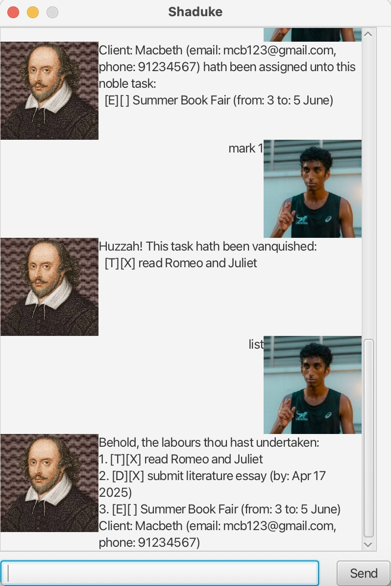

# Shaduke User Guide



Hi! I'm a shakespeare-themed task manager!
You can use me both in the command line and as a GUI

## Adding todos

Adds a normal task to the task list!

Example: `todo read Romeo and Juliet`

A message confirming the task has been added will be displayed.

```
Lo! A task is wrought and placed upon thy list:
    [T][ ] read Romeo and Juliet
Thou now possesseth 1 noble charges to fulfill.
```

## Adding deadlines

Adds a task with a deadline. Date has to be in YYYY-MM-DD format.

Example: `deadline submit literature essay /by 2025-04-17`

A message confirming the task has been added will be displayed.

```
Lo! A task is wrought and placed upon thy list:
  [D][ ] submit literature essay (by: Apr 17 2025) 
Thou now possesseth 2 noble charges to fulfill.
```
## Adding events

Adds an event with a start and end date/time.

Example `event Summer Book Fair /from 3 /to 5 June`

A message confirming the task has been added will be displayed.

```
Lo! A task is wrought and placed upon thy list:
  [E][ ] Summer Book Fair (from: 3 to: 5 June) 
Thou now possesseth 3 noble charges to fulfill.
```

## List

Lists all tasks currently on the task list.

Example `list`

A list of all tasks will be displayed.

```
Behold, the labours thou hast undertaken:
1. [T][ ] read Romeo and Juliet 
2. [D][ ] submit literature essay (by: Apr 17 2025) 
3. [E][ ] Summer Book Fair (from: 3 to: 5 June) 
```

## Mark

Marks the chosen task as done.

Example `mark 2`

Displays a message confirming the task has been marked.

```
Huzzah! This task hath been vanquished:
  [D][X] submit literature essay (by: Apr 17 2025) 
```

## Unmark

Marks the chosen task as not done yet.

Example `unmark 2`

Displays a message confirming the task has been unmarked.

```
Soft! this task hath been vanquished:
  [D][ ] submit literature essay (by: Apr 17 2025) 
```

## Find

Lists the task that contain the search word.

Example `find Book`

Displays all tasks that have Book in it

```
Here are the tasks with Book:
3. [E][ ] Summer Book Fair (from: 3 to: 5 June) 
```

## Delete 

Removes a task completely from the list.

Example: `delete 1`

Displays a message confirming the selected task has been deleted.

```
Alas! This task hath met its end, consigned to oblivion:
  [T][ ] read Romeo and Juliet 
Yet thou hast 2 tasks still in thy ledger.
```

## Add Client

Adds a client to the list of clients.

Example: `client add Macbeth /email mcb123@gmail.com /phone 98765432`

Displays a message confirming the client has been added.

```
Hail! Client: Macbeth (email: mcb123@gmail.com, phone: 98765432) hath entered thy service.
Thou now commandest 1 loyal clients.
```

## List Clients

List all added clients.

Example: `client list`

Displays all clients.

```
Behold, thy valiant clients:
1. Client: Macbeth (email: mcb123@gmail.com, phone: 98765432)
```

## Assign Client

Assigns a selected client to a task.

The first number given is the task index while the second number is the client index.

Example: `client assign 2 1`

Displays a message confirming the client has been assigned to the task.

```
Client: Macbeth (email: mcb123@gmail.com, phone: 98765432) added to [E][ ] Summer Book Fair (from: 3 to: 5 June)
```

## Find Client's Tasks

Lists all tasks the client is part of. Input number is client index.

Example: `client tasks 1`

Displays the tasks involving the client.

```
Tasks wherein Client: Macbeth (email: mcb123@gmail.com, phone: 98765432) doth partake:
2. [E][ ] Summer Book Fair (from: 3 to: 5 June) 
```

## Leave Task

Removes a client from a task.

The number input is the task index.

Example: `client leave 2`

Displays a message confirming the client has left the task.

```
Client: Macbeth (email: mcb123@gmail.com, phone: 98765432) hath forsaken the task numbered 2
```

## Delete Client

Deletes the client after removing it from all tasks it is involved in.

Example: `client delete 1`

Displays a message confirming the client has been deleted.

```
Alas! Client: Macbeth (email: mcb123@gmail.com, phone: 98765432) hath departed from thy fold.
```

## Exit

Closes the CLI program and displays a farewell message.

Example: `bye`

```
Fare thee well, noble soul. May Morpheus grant thee sweet visions and respite.
Till we meet anon, upon the morrow's stage of deeds and tasks.
```